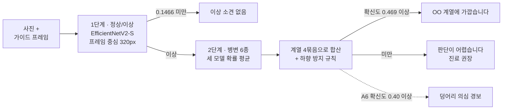

# 🐕 dog-skin-screening

**반려견 피부 사진 2단계 스크리닝.** 확신이 있으면 병변 계열을 말하고,
확신이 없으면 판단이 어렵다고 말한다. 진단이 아니라 *"병원에 가보세요"* 까지가 목표다.


> ⚠️ 수의학적 진단 도구가 아니다. 수의사의 진료를 대체하지 않는다.

| 지표 | 라벨러 네모 (상한) | 보호자 조건 (프록시) | 어디서 |
|---|---:|---:|---|
| 1단계 AUROC | **0.9304** | — | holdout |
| 1단계 병변 recall / 헛알림 | **94.3%** / 18.7% | — | holdout, 문턱 0.1466 |
| 1단계 recall / 헛알림 (같은 표본) | 86.8% / 34.0% | **72.9% / 34.3%** | 프록시 2,500+586장 |
| 2단계 6종 macro-F1 | **0.5990** | — | holdout |
| 계열 4군 커버리지 (3팔) | **66.5%** | — | holdout |
| 계열 4군 커버리지 (3팔, 같은 표본) | 58.8% | **31.6%** | 프록시 |

<sub>**라벨러 네모**는 라벨러가 병변에 딱 맞춰 그린 bbox로 자른 값이라 상한이다.
**보호자 조건**은 앱처럼 축소·재압축한 사진에 보호자처럼 그린 네모를 씌운 흉내라,
절대값보다 같은 표본에서 두 열의 차이를 본다.</sub>

---

## 왜 만들었나

보호자가 사진 한 장으로 묻는 건 *"이거 병원 가야 해?"* 다. 병변 이름 6종을 맞히는
분류기를 만들기는 쉽다. 그런데 holdout에서 그 이름이 **46.3% 틀린다.** 두 번에 한 번
틀리는 이름을 굵게 띄우면 보호자는 그걸 답으로 읽는다.

그래서 목표를 *"무엇인지 맞히기"* 가 아니라 **"놓치지 않기, 그리고 모를 때는 모른다고
말하기"** 로 잡았다. 두 달 동안 6종 이름에 매달리다 질문을 바꾼 게 이 프로젝트의 전환점이다.

## 무엇이 다른가

| | 흔한 방식 | 이 프로젝트 |
|---|---|---|
| 자신 없는 사진 | 1등 클래스를 그냥 말한다 | 확신이 문턱 아래면 **"판단이 어렵습니다"** — 오답률 20% 이하로 사진의 66.5%에 답한다 |
| 안 갈리는 클래스 | 백본을 더 키운다 | **질문의 알갱이를 바꿨다.** 같은 모델·같은 확률로 6종 → 4계열. 추론 0회로 커버리지 41.1% → 66.5% |
| 성능 숫자 | 가장 좋은 조건의 숫자 | 라벨 네모 값은 **상한**이라고 적고, 보호자 조건 값을 옆에 둔다 |
| 데이터 분할 | 이미지 단위 랜덤 | 개체 ID ∪ pHash 근접 중복을 union-find로 묶어 **그룹 단위** 분할, 누수가 있으면 에러 |
| 급한 병변 | 평균 정확도에 묻힌다 | 급한 쪽 확률이 크면 덜 급한 계열을 후보에서 뺀다 — 미란·궤양 하향 43.8% → 36.8% |

## 동작 방식



1. **1단계는 놓치지 않는 쪽으로 자른다.** EfficientNetV2-S가 가이드 프레임 **중심**에서
   320px 고정 창을 본다. 흐린 사진을 지름길로 쓰던 걸 `photometric` 증강으로 막았다
   (흐리게 하면 AUROC 0.743 → 0.332로 동전 던지기가 되던 모델이었다)
2. **2단계는 세 모델의 확률을 평균한다.** ConvNeXtV2-Base `m2.5` · EfficientNetV2-S `m2.5` ·
   EfficientNetV2-S `f320`. 이득은 모델 수가 아니라 **크롭 종류**에서 났다 — 백본만 바꿔
   더하면 +0.019(잡음권), 네모에 비례하는 창과 고정 창을 섞으면 +0.058. CPU 추론 774 → 1052ms
3. **계열 4묶음은 데이터를 보기 전에 문헌으로 정했다.** 솟아오른 변화(A1·A4) ·
   피부 표면·색·두께 변화(A2·A3) · 벗겨지거나 패인 상처(A5) · 깊거나 단단한 혹(A6).
   primary/secondary 축, 구진과 결절을 가르는 1cm 경계, 표피 소실 여부, ICADA 가이드라인
   (Hensel et al. 2015)이 근거다. 혼동행렬을 보고 묶으면 어떤 묶음이든 좋아 보이기 때문이다.
   A6은 종양 감별이 필요한 유일한 클래스라 따로 둔다
4. **확신도는 `p(이상) × p(계열)` 이다.** 오답이 두 종류(정상인데 말함 / 병변인데 틀림)라
   한쪽만 보면 다른 쪽이 통과한다. 곱으로 쟀을 때 커버리지가 `p(계열)` 단독의 10배였다

## 숫자로 본 과정

**오답률 20% 이하에서 몇 장에 답할 수 있나** (holdout, 라벨 네모)

| 무엇을 말하나 | 커버리지 | 판정 |
|---|---:|---|
| 6종 이름 · 모델 1개 | 25.4% | 닫음 |
| 6종 이름 · 3팔 평균 | 41.1% | 논의 문턱(50%) 미달 |
| 계열 4군 · 모델 1개 | 58.4% | |
| 계열 4군 · 3팔 평균 | 67.9% | |
| **+ 하향 방지 규칙** | **66.5%** | ✅ 채택 — 긴급도 하향 3.7% → 2.9% |
| 긴급도 2등급만 | 89.4% | ❌ 실제로 급한 것의 40.7%를 "안 급하다"고 말함 |
| 교과서 primary/secondary 2군 | 72.9% | ❌ 과잉 89.0% — 구진 하나에도 "조기 진료" |

커버리지는 확신 높은 순으로 답하다가 누적 오답률이 20%를 넘기 직전까지의 비율이다.
굵게 묶을수록 정확도는 공짜로 오르지만(제일 흔한 묶음만 말해도 67%), 커버리지는
아무 생각 없이 답하면 0%라 **순위가 부풀지 않는다.** 대신 1등 두 개를 막으려고
관문을 둘 더 뒀다 — 급한 걸 순하게 말하는 **하향**(≤ 5%)과 A6 오명명(≤ 30%).

## 틀린 걸 찾아낸 기록

잘 된 숫자보다 **조용히 틀리고 있던 것을 찾은 과정**이 이 프로젝트의 대부분이다.

- **2단계는 네모를 안 쓰고 있었다.** `m2.5` 창은 네모 긴 변 × 2.5라, 네모가 화면의
  47%만 넘어도 사진 전체를 덮는다. 사람이 그린 네모 40장이 전부 그랬고, 배포 모델의
  2단계 macro-F1이 **사용자 네모 0.3720 / 네모 없음 0.3720** 으로 소수점까지 같았다.
  모델도 GPU도 필요 없는 산수였는데, 사람 40장을 두 번 그리게 하고 파인튜닝을 세 번
  돌린 뒤에야 했다
- **요약이 조건을 잃었다.** *"가이드 프레임은 **2단계** 성능을 안 바꾼다"* 가 몇 단계 만에
  *"아무 일도 안 한다"* 로 줄었고 *"틀을 없애자"* 가 나왔다. 1단계는 프레임의 **중심**을
  쓰고 있어서 recall이 0.739 → 0.617로 무너졌다 — 허용치의 12배
- **모델 1개로 재면 부호까지 틀린다.** 검출기로 자른 크롭이 모델 1개에서는 커버리지
  +8.3%p라 관문을 통과해 보였는데, 배포 구성인 3팔로 재니 −0.9%p였다. 그 뒤로 판정은
  배포 구성과 보호자 조건에서만 한다
- **하한선 없는 정확도는 숫자가 아니었다.** 계열 3군 정확도 0.8365를 개선 근거로
  앞세웠는데 제일 흔한 묶음이 이미 67.1%였다. 하한선 대비로는 6종 +35.1%p,
  3군 +16.5%p로 방향이 뒤집힌다. 그래서 정확도 대신 커버리지를 쓴다
- **앙상블이 1팔로 강등됐는데 HTTP 200이었다.** 서버에 가중치를 코드보다 먼저 넣어서
  옛 코드가 팔을 덮어썼다. 단서는 성공 로그가 **안 찍힌 것** 하나였다. 지금 팀 백엔드는
  Hugging Face에서 리비전을 고정해 받고, 팔 수가 안 맞으면 모델을 안 올리고 503을 낸다
- **90GB zip이 열리는데 읽으면 전부 깨졌다.** 조각 순서가 뒤바뀌었는데 목차 위치가
  우연히 정확히 맞아 526,681개가 다 보였다. 로컬 헤더를 대조하는 검사만이 걸렀다
  (`tools/fix_split_zip.py`)
- **실패한 실험도 남겼다.** 보호자 네모를 더 잘 받으려고 연 열한 갈래(점 하나만 받기 ·
  모델이 네모 제안 · 검출기 학습 · 데이터 7배 · D-FINE · 네모 잡음 증강 · 병변 보존
  random crop 등)는 전부 기각했고, 무엇이 틀렸는지를 [`docs/results/`](docs/results/)
  65편에 적었다

## 데이터

| 소스 | 규모 | 비고 |
|---|---|---|
| AI Hub 「반려동물 피부 질환」 ([dataSetSn=561](https://aihub.or.kr/aihubdata/data/view.do?dataSetSn=561)) | **365,428장** (정제·중복 제거 후) | 반려견 · 일반 카메라. 병변 형태 A1~A6 + 무증상 A7 |

- **개체 단위로 나눈다.** 개체당 평균 50장이라 이미지 단위로 나누면 같은 개가 train과
  holdout에 같이 들어간다. `src/split.py` 가 개체 ID와 pHash 근접 중복 클러스터(256bit,
  해밍 거리 ≤ 6)를 union-find로 합쳐 그룹 단위로 train/val/holdout을 나누고, 겹치면
  에러를 낸다. 라벨이 충돌하는 중복 묶음은 통째로 버린다
- **원본과 크롭 이미지는 재배포 금지다.** 이 저장소에는 코드와 실측 숫자만 있다.
  AI Hub가 해외 IP를 막아서 전처리는 한국 PC, 학습은 Kaggle(Private)에서 했다

## 기술 스택

| 영역 | 사용 |
|---|---|
| 학습 | PyTorch, timm (EfficientNetV2-S · ConvNeXtV2-Base), albumentations, AMP · EMA · cosine warmup |
| 데이터 | pandas + pyarrow (parquet 매니페스트), imagehash (pHash), OpenCV |
| 평가 | 부트스트랩 CI, temperature scaling · ECE, coverage-risk, Grad-CAM 정렬도 (holdout lift 4.55) |
| 서빙 | FastAPI 데모 서버 + 단일 HTML 데모 화면 |
| 실행 | uv, Kaggle / Colab, 로컬 RTX 3050 |

## 이 모델이 쓰이는 곳

팀 프로젝트 **댕스**(반려견 케어 Android 앱)의 피부 스크리닝 기능이다. 이 저장소가
원본이고, 팀 백엔드(FastAPI)가 사본을 가져가 서빙하며 앱은 결과 카드로 보여준다.
팀 저장소는 비공개다.

## 빠른 시작

```bash
git clone https://github.com/gayeoniee/dog-skin-screening.git
cd dog-skin-screening
uv sync --extra serve
uv run --extra serve python serve.py --mock   # 가중치 없이 화면 확인 → http://127.0.0.1:8000/
uv run python tests/test_stages.py            # 설치 확인
```

`--mock` 은 모델 없이 같은 모양의 응답을 만든다 (숫자는 모델 출력이 아니고 화면에 `MOCK`
배지가 뜬다). 데이터 받기(한국 PC) → 학습(Kaggle/Colab) 전체 절차는
[`docs/개발기록.md`](docs/개발기록.md#빠른-시작) 에 있다.

## 문서 지도

| 문서 | 내용 |
|---|---|
| [docs/정리_처음부터_지금까지_2026-09-13.md](docs/정리_처음부터_지금까지_2026-09-13.md) | 처음 보는 사람을 위한 한 장 요약 |
| [docs/개발기록.md](docs/개발기록.md) | STEP 순서로 적은 전체 이야기 (예전 README) |
| [CLAUDE.md](CLAUDE.md) | 작업 규칙 · 결론 · 실제로 당한 함정 30+ |
| [STATUS.md](STATUS.md) · [HISTORY.md](HISTORY.md) | 지금 숫자와 열린 문제 · 왜 그렇게 결정했나 |
| [docs/results/](docs/results/) | 실측 원본 — 숫자는 전부 여기서 나온다 |
| [docs/SERVING.md](docs/SERVING.md) | 앱 연동 계약 |
| [notebooks/README.md](notebooks/README.md) | 노트북을 언제, 무엇을 붙여서 돌리나 |

## 한계와 다음 단계

- **보호자 조건에서 커버리지가 상한의 절반쯤이다** (같은 표본 58.8% → 31.6%).
  네모를 더 잘 받으려 했지만 병변 중심 오차가 모델·데이터를 바꿔도 0.10~0.13에서
  안 움직였다. 번진 병변(비듬·태선화)은 사람도 중심을 못 찍는다 — 탭이 병변 안에
  든 비율 47.5%. 벽은 모델이 아니라 라벨이었다
- **미란·궤양(A5)과 농포(A4)가 약하다.** A5 포착 38.0%(모델 1개), A4 recall 0.264.
  솟았는지 파였는지, 속에 고름이 있는지 — 입체감이 사진 한 장에 안 찍힌다는 게
  소거법으로 남은 설명이다
- **촬영 가이드의 효과는 관찰이지 개입 실험이 아니다.** 헛알림이 털 덮인 부위 순서를
  따른다는 건 쟀지만, 가이드를 줬을 때 줄어드는지는 안 쟀다
- **새로 받은 원본(370,671장)으로 채택 설정을 다시 학습하지 않았다.** 그 데이터의
  근접 중복 검사와 수의사의 라벨 검수도 아직이다
- 다음: 실제 보호자 사진을 모아 보호자 조건 holdout 만들기

<sub>학습 데이터: **반려동물 피부 질환 데이터** — 출처 [AI 허브](https://aihub.or.kr) (`dataSetSn=561`)</sub>
